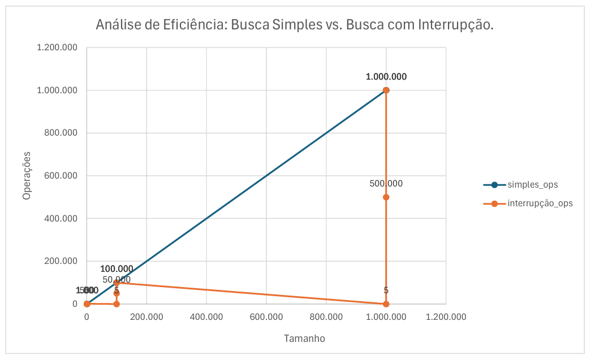

# Relatório Técnico: Experimento de Algoritmos de Busca em Rust
**Estudante:** Sergio Pinton Pavanelli  
**Curso:** Ciência da Computação (EDAA)  
**Data:** 25 de Fevereiro de 2026  

---

## 1. Descrição do Experimento

O objetivo deste trabalho foi a implementação e análise empírica de dois algoritmos de busca sequencial para compreender a eficiência e o custo computacional de diferentes abordagens.

* **Busca Sequencial Simples:** Percorre obrigatoriamente todo o vetor, do início ao fim, mesmo após encontrar o alvo.
* **Busca Sequencial com Interrupção:** Variante otimizada que encerra a execução assim que o elemento é localizado.

---

## 2. Resultados Coletados (Seção 6)

Os testes foram realizados utilizando a flag `--release` para garantir medições realistas via otimizações do compilador.  
Os valores de "ops" representam o número de operações/comparações realizadas.

| Tamanho do Vetor | Posição do Alvo | Simples (ops) | Interrupção (ops) | Diferença (ops) |
| :--- | :--- | :--- | :--- | :--- |
| **1.000** | Início | 1.000 | 5 | 995 |
| **1.000** | Meio | 1.000 | 500 | 500 |
| **1.000** | Final | 1.000 | 1.000 | 0 |
| **100.000** | Início | 100.000 | 5 | 99.995 |
| **100.000** | Meio | 100.000 | 50.000 | 50.000 |
| **100.000** | Final | 100.000 | 100.000 | 0 |
| **1.000.000** | Início | 1.000.000 | 5 | 999.995 |
| **1.000.000** | Meio | 1.000.000 | 500.000 | 500.000 |
| **1.000.000** | Final | 1.000.000 | 1.000.000 | 0 |

---

## 3. Análise das Questões Orientadoras (Seção 5.1)

* **Qual algoritmo executa mais operações?**  
A busca sequencial simples sempre executa *n* operações (tamanho completo do vetor), enquanto a busca com interrupção varia conforme a posição do elemento.

* **O resultado muda conforme o tamanho do vetor?**  
Sim. A disparidade de desempenho torna-se significativamente maior e mais perceptível em vetores grandes, especialmente acima de 100.000 elementos.

* **Em que situações a diferença se torna perceptível?**  
A diferença é clara quando o vetor é grande, quando o alvo está no início ou meio, ou quando são realizadas múltiplas buscas sucessivas.

---

## 4. Exercícios Propostos (Seção 9)

### Exercício 1: Busca de Strings

Implementação da busca adaptada para tipos de texto:

```rust
fn busca_strings(vetor: &[String], alvo: &str) -> Option<usize> {
    for (i, item) in vetor.iter().enumerate() {
        if item == alvo { return Some(i); }
    }
    None
}
```

### Exercício 2: Contagem de Ocorrências

Algoritmo para identificar a frequência de um elemento no vetor:

```rust
fn contar_ocorrencias(vetor: &[i32], alvo: i32) -> usize {
    let mut contador = 0;
    for &item in vetor {
        if item == alvo {
            contador += 1;
        }
    }
    contador
}
```

---

### Exercício 3: Análise Gráfica

O gráfico gerado demonstra a complexidade linear **O(n)** da busca simples, onde o número de operações cresce em linha reta proporcionalmente ao tamanho da entrada, contrastando com o custo variável da busca interrompida.



---

### Exercício 4: Retornar Todas as Posições

Função que mapeia todos os índices encontrados:

```rust
fn buscar_todas_posicoes(vetor: &[i32], alvo: i32) -> Vec<usize> {
    let mut posicoes = Vec::new();
    for (i, &item) in vetor.iter().enumerate() {
        if item == alvo {
            posicoes.push(i);
        }
    }
    posicoes
}
```

---

# 5. Conclusão

O experimento demonstra que pequenas otimizações, como a interrupção antecipada, são vitais para a escalabilidade.

Enquanto a busca simples possui custo fixo **O(n)**, a busca com interrupção oferece um melhor caso de **O(1)**, sendo fundamental para o processamento eficiente de grandes volumes de dados.

---

**Documento gerado para a Aula 02 - Professor Alexandre Montanha.**
